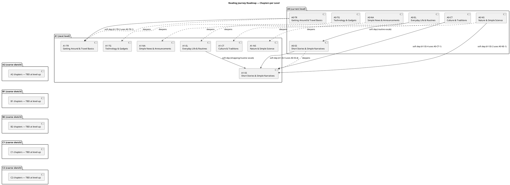

# Global Curriculum Roadmap (Phase 02 output — language-agnostic)

This is the shared, language-agnostic version of the Phase 02 deliverable. It is **not** tied to any single language pair. Every `contents/<language_pair>/task_language_reading/roadmap.md` is a short pointer to this file, plus that pair's own local deltas (current level, any customized topic titles, its own discrepancy log entries, its own amendment log).

This is the **table of contents** for the journey — no reading texts, no specific vocabulary/grammar lists live here (that's Phase 04/05).

## Why this file is shared

The inputs Phase 02 draws on — `phase_00_intake.md`'s Reading Interests & Themes and `cefr_level.md`'s level definitions — describe universal life themes (daily life, travel, technology, news) and the universal CEFR ladder, not anything specific to a given target language. The chapter/topic skeleton below is therefore identical across language pairs by construction; only a handful of details are genuinely language-specific, and those are called out inline below and left to each pair's local pointer file rather than baked in here.

## 1. Level Recap

Full scale, in order: **A0 → A1 → A2 → B1 → B2 → C1 → C2**

A learner's **current level** is pair-specific (you may be further along in one language than another) — it lives in that pair's own `cefr_level.md`, not here.

## 2. Detail Horizon

**Default: current level + next level get full chapter/topic detail** (this document covers A0 and A1, since that was every existing pair's starting point). A2 through C2 get a one-line sketch only (Section 5), expanded to full detail by Phase 06 at each real level-up. This was chosen over detailing only the current level (would leave zero forward visibility) or three levels ahead (higher rework risk, since the furthest-out detail is least likely to survive contact with reality).

If a language pair starts at a level other than A0, its local pointer file should note that the "full detail" section of this document needs re-deriving for its actual current + next level — the reasoning and format carry over, the specific chapters/topics don't automatically.

## 3. Chapter Map per Level

Each of the 4 recurring themes (Daily life & Fiction/Stories, Travel & Culture, Technology & Science, News & Current affairs) is split into finer chapters to maximize variety, except **News & Current Affairs**, which stays as one chapter (see the Section 11 note — genuine reported news doesn't fit A0/A1's vocabulary ceiling in any language).

Each level reuses the same 7 chapters, deepened at the next level.

### A0 Chapters

| Chapter ID | Title | Objective | Traces to theme |
|---|---|---|---|
| A0-EL | Everyday Life & Routines | Build vocabulary/simple-present patterns for short first-person statements about oneself and one's day. | Daily life & Fiction/Stories |
| A0-SS | Short Stories & Simple Narratives | Apply everyday-life vocabulary to very short narrated scenes with a beginning-middle-end. | Daily life & Fiction/Stories |
| A0-TR | Getting Around & Travel Basics | Introduce vocabulary for very short travel notices and simple directions. | Travel & Culture |
| A0-CT | Culture & Traditions | Introduce vocabulary for simple, purely descriptive cultural facts and customs. | Travel & Culture |
| A0-TG | Technology & Gadgets | Introduce vocabulary for everyday tech objects and very simple usage instructions. | Technology & Science |
| A0-NS | Nature & Simple Science | Introduce vocabulary for weather, animals, and simple observable natural facts. | Technology & Science |
| A0-NA | Simple News & Announcements | Introduce the narrowest realistic slice of "news"-style text at true-beginner level: announcements, not reported news. | News & Current affairs |

### A1 Chapters

| Chapter ID | Title | Objective | Traces to theme |
|---|---|---|---|
| A1-EL | Everyday Life & Routines | Read longer first-/third-person daily-life accounts using simple compound sentences and light connectors (e.g., "and," "then," "because"). | Daily life & Fiction/Stories |
| A1-SS | Short Stories & Simple Narratives | Read short connected narratives (4–6 sentences) with sequencing connectors. | Daily life & Fiction/Stories |
| A1-TR | Getting Around & Travel Basics | Read longer travel exchanges and simple multi-step directions. | Travel & Culture |
| A1-CT | Culture & Traditions | Read short comparative/descriptive texts about customs with more connective structure. | Travel & Culture |
| A1-TG | Technology & Gadgets | Read short instructional/descriptive texts about tech use, including simple step sequencing. | Technology & Science |
| A1-NS | Nature & Simple Science | Read short factual texts about nature with more elaboration than single-sentence A0 facts. | Technology & Science |
| A1-NA | Simple News & Announcements | Read slightly longer, still concrete, present-tense-anchored notices — edging toward but not yet real reported news. | News & Current affairs |

## 4. Topics per Chapter

Topic counts follow a shared word-budget rule: at **~15–20 new words/topic**, ~34 topics per level puts each level's total new vocabulary at roughly 510–680 words — within the commonly cited ~500–1,000 word target for the A0→A1 transition (comparable across languages, since the underlying CEFR vocabulary consensus figures don't vary much by language). Exact word counts are finalized per-topic by Phase 04, not fixed here.

### A0-EL — Everyday Life & Routines (6 topics)

1. **A0-EL-1 — Greetings & Introducing Yourself.** Names, basic greetings, "I am / My name is" statements. Builds: reading a name tag or short self-introduction.
2. **A0-EL-2 — Family & People Around Me.** Family words, simple possessives ("my mother," "his brother"). Builds: reading a short family description.
3. **A0-EL-3 — At Home.** Rooms, common household objects, "there is/are" statements. Builds: reading a short room/house description.
4. **A0-EL-4 — Daily Routine (Morning to Night).** Routine verbs (wake up, eat, sleep) in simple present. Builds: reading a short first-person account of a typical day.
5. **A0-EL-5 — Food & Meals.** Basic food/drink words, simple likes/dislikes. Builds: reading a short note about what someone eats.
6. **A0-EL-6 — Numbers, Time & Simple Prices.** Cardinal numbers, telling time, simple prices. Builds: reading incidental numeric information (ages, clock times, costs) embedded in everyday sentences.

### A0-SS — Short Stories & Simple Narratives (4 topics)

1. **A0-SS-1 — A Short Day in the Life.** A tiny third-person retelling reusing A0-EL vocabulary. *Soft dependency: A0-EL-4.*
2. **A0-SS-2 — A Simple Surprise.** A 2–3 sentence "twist" mini-story. Builds: reading simple sequencing with "then."
3. **A0-SS-3 — Meeting Someone New.** A tiny narrative dramatizing a first-time introduction. *Soft dependency: A0-EL-1.*
4. **A0-SS-4 — A Simple Animal Story.** A short story about a pet doing something simple. Builds: third-person action sentences outside daily-life context.

### A0-TR — Getting Around & Travel Basics (5 topics)

1. **A0-TR-1 — Asking for Directions.** Direction words (left, right, straight), simple questions. Builds: reading a short direction-giving exchange.
2. **A0-TR-2 — Transportation Basics.** Vehicle words, simple travel verbs (go, arrive). Builds: reading a simple transit announcement/ticket.
3. **A0-TR-3 — At the Airport/Station.** Signage vocabulary (arrivals, departures, gate). Builds: reading simple public signage.
4. **A0-TR-4 — Booking a Simple Trip.** Basic reservation vocabulary (date, ticket). Builds: reading a short confirmation message.
5. **A0-TR-5 — Asking for Help While Traveling.** Polite requests, simple problem statements ("I am lost"). Builds: reading a short help-request exchange.

### A0-CT — Culture & Traditions (5 topics)

1. **A0-CT-1 — Holidays & Celebrations.** Common holiday names, simple celebratory verbs. Builds: reading a one-line holiday description.
2. **A0-CT-2 — Simple Table Manners & Customs.** Basic etiquette vocabulary. Builds: reading a short "do/don't" customs note.
3. **A0-CT-3 — Clothes & Everyday Style.** Clothing item words. Builds: reading a short description of what someone is wearing.
4. **A0-CT-4 — Music & Simple Hobbies.** Basic hobby/activity words. Builds: reading a short "what someone likes to do" statement.
5. **A0-CT-5 — Greetings Around the World.** Light contrastive statements ("In [place], people say..."). Builds: reading simple comparative sentences. *Per-pair customization option: if the target language has meaningfully distinct regional varieties (e.g., Spanish: Spain vs. Latin America), a language pair may rename its local copy to something like "Greetings Around the [Language]-Speaking World" and lean into that regional contrast — record that as a local delta, don't change the title here.*

### A0-TG — Technology & Gadgets (5 topics)

1. **A0-TG-1 — My Phone.** Phone vocabulary, simple ownership statements. Builds: reading a short device description.
2. **A0-TG-2 — Using a Computer.** Basic computer parts/actions (turn on, click). Builds: reading a very short instruction list.
3. **A0-TG-3 — The Internet & Messages.** Basic internet vocabulary (message, send, call). Builds: reading a short text-message-style exchange.
4. **A0-TG-4 — Photos & Simple Apps.** Everyday app-use vocabulary. Builds: reading a short description of a digital activity.
5. **A0-TG-5 — Simple Machines at Home.** Household appliance vocabulary. Builds: reading a short appliance description/instruction.

### A0-NS — Nature & Simple Science (5 topics)

1. **A0-NS-1 — Weather Basics.** Weather words, simple present-tense statements. Builds: reading a one-line weather report.
2. **A0-NS-2 — Animals Around Us.** Common animal names, simple habitat statements. Builds: reading a short animal-fact sentence.
3. **A0-NS-3 — The Seasons.** Season names, simple seasonal-activity statements. Builds: reading a short seasonal description.
4. **A0-NS-4 — Plants & Simple Nature Facts.** Plant vocabulary, simple factual statements. Builds: reading a one-line nature fact.
5. **A0-NS-5 — Day & Night, Sun & Moon.** Basic astronomy-adjacent vocabulary. Builds: reading a very short descriptive fact.

### A0-NA — Simple News & Announcements (4 topics)

1. **A0-NA-1 — A Simple Weather Announcement.** Headline-style single-sentence weather notices. Builds: reading a single declarative headline.
2. **A0-NA-2 — A Simple Event Announcement.** Single-sentence notices about an event. Builds: reading a short public announcement.
3. **A0-NA-3 — A School/Community Notice.** Simple notice-board text (closed today, open at X). Builds: reading a short operational notice.
4. **A0-NA-4 — A One-Line Headline.** An extremely short present-tense "headline" sentence. Builds: reading the shortest possible news-style statement.

**A0 total: 34 topics.**

---

### A1-EL — Everyday Life & Routines (5 topics)

1. **A1-EL-1 — A Full Day, Start to Finish.** A longer routine account with sequencing connectors. *Soft dependency: A0-EL-4.*
2. **A1-EL-2 — My Neighborhood.** Describing nearby places (shop, park, school). Builds: reading a short neighborhood description.
3. **A1-EL-3 — Weekend Plans.** Simple future-oriented statements ("I am going to..."). Builds: reading simple plan/intention statements.
4. **A1-EL-4 — Shopping for Groceries.** Shopping vocabulary, simple quantities. Builds: reading a short shopping list/errand account.
5. **A1-EL-5 — Health & Feeling Sick.** Basic health vocabulary, simple symptom statements. Builds: reading a short "how I feel today" note.

### A1-SS — Short Stories & Simple Narratives (6 topics)

1. **A1-SS-1 — A Trip to the Market.** A short narrative sequence. *Soft dependency (helpful, not required): A1-EL-4.*
2. **A1-SS-2 — A Rainy Day.** A short narrative built around a weather-driven event. *Soft dependency: A0-NS-1.*
3. **A1-SS-3 — Losing Something.** A short "problem and simple resolution" story.
4. **A1-SS-4 — A Birthday Party.** A short celebratory narrative. *Soft dependency: A0-CT-1.*
5. **A1-SS-5 — A New Pet.** A short narrative about getting/caring for a pet. *Soft dependency: A0-SS-4.*
6. **A1-SS-6 — A Small Adventure.** A short narrative about a simple unplanned event during a routine day.

### A1-TR — Getting Around & Travel Basics (5 topics)

1. **A1-TR-1 — Planning a Weekend Trip.** A simple planning-style text.
2. **A1-TR-2 — A Multi-Step Direction.** Directions with more than one step, using sequencing connectors. *Soft dependency: A0-TR-1.*
3. **A1-TR-3 — A Travel Problem.** A short "something went wrong while traveling" text (missed bus, lost ticket).
4. **A1-TR-4 — Staying at a Hotel.** Hotel vocabulary, simple request statements.
5. **A1-TR-5 — Meeting a Local Guide.** A short dialogue-style text with simple question-answer exchanges.

### A1-CT — Culture & Traditions (4 topics)

1. **A1-CT-1 — A Local Festival.** A short descriptive text about a festival/celebration.
2. **A1-CT-2 — Traditional Food.** A short text describing a traditional dish and when it's eaten.
3. **A1-CT-3 — A Family Tradition.** A short first-person account of a family custom.
4. **A1-CT-4 — Comparing Customs.** A short comparative text ("In my country... but here..."). *Per-pair customization option: languages with strong regional variety (see A0-CT-5) may lean this into a regional comparison instead of a cross-country one — record as a local delta.*

### A1-TG — Technology & Gadgets (5 topics)

1. **A1-TG-1 — Setting Up a New Phone.** A short step-by-step instructional text.
2. **A1-TG-2 — A Video Call with Family.** A short narrative/dialogue about video calling.
3. **A1-TG-3 — Online Shopping Basics.** A short text about buying something online.
4. **A1-TG-4 — Password & Simple Safety Habits.** A short text about basic digital safety habits.
5. **A1-TG-5 — A Broken Gadget.** A short "something isn't working" problem-description text.

### A1-NS — Nature & Simple Science (5 topics)

1. **A1-NS-1 — A Simple Weather Forecast.** A short multi-sentence forecast text.
2. **A1-NS-2 — Animal Habits.** A short descriptive text about how an animal behaves.
3. **A1-NS-3 — A Simple Plant's Life Cycle.** A short sequential factual text (seed, sprout, grow).
4. **A1-NS-4 — Recycling & Simple Environment Facts.** A short factual/awareness text.
5. **A1-NS-5 — Stars & Simple Space Facts.** A short descriptive text about space basics.

### A1-NA — Simple News & Announcements (4 topics)

1. **A1-NA-1 — A Community Event Notice.** A slightly longer multi-sentence announcement.
2. **A1-NA-2 — A Simple Weather Warning.** A short warning-style notice.
3. **A1-NA-3 — A School/Workplace Update.** A short operational update notice.
4. **A1-NA-4 — A "What's Happening Today" Brief.** A short multi-sentence roundup of simple daily happenings (still descriptive/present-tense, not real reported news).

**A1 total: 34 topics.**

**Roadmap total within detail horizon: 68 topics across 14 chapters.**

## 5. Coarse Sketch (Beyond the Detail Horizon)

Expanded to full chapter/topic detail by Phase 06 when each level is actually reached — not designed now. Kept deliberately generic here since some of what changes at these levels (which specific grammatical features become "load-bearing," which real-world dialectal variety appears) is language-specific — a pair's local pointer file may append a language-specific footnote to any of these without needing to fork the whole section.

- **A2** — Short simple texts on familiar topics (simple narratives, basic emails/instructions) with basic sequencing connectors; still no idiomatic language.
- **B1** — Straightforward factual texts (simple news articles, blogs, personal letters) with basic subordination and the first genuinely idiomatic set phrases.
- **B2** — Articles/reports on contemporary issues and straightforward literary prose, with more complex syntax (relative clauses, passive voice, conditionals) and, if the language has meaningful regional variation, first real exposure to it.
- **C1** — Long, complex texts including implicit meaning, literary and moderately technical writing, dense idiomatic/figurative language, navigating dialectal variety where it exists.
- **C2** — Virtually any text, including abstract/structurally complex material (legal, academic, literary classics), full sensitivity to nuance and style across registers/varieties.

## 6. Ordering Is a Default, Not a Mandate

Chapters and topics above are listed in a suggested, dependency-light order (roughly increasing complexity within a level). Reading-comprehension topics rarely have a hard prerequisite chain the way technical topics do — any topic on this map, or a brand-new ad-hoc one, may be requested in any order, via Phase 04.

**Two kinds of soft linkage exist, both non-blocking but worth Phase 04 checking before honoring an out-of-order/ad-hoc request:**

1. **Chapter-level "deepens" relationship** — each A1 chapter deepens its same-named A0 chapter (e.g., A1-EL deepens A0-EL). This is thematic continuity, not a hard gate.
2. **Explicit topic-level soft dependencies:**
   - A0-SS-1 assumes A0-EL-4 (Daily Routine) vocabulary.
   - A0-SS-3 assumes A0-EL-1 (Greetings) vocabulary.
   - A1-SS-2 assumes A0-NS-1 (Weather Basics) vocabulary.
   - A1-SS-4 assumes A0-CT-1 (Holidays & Celebrations) vocabulary.
   - A1-SS-5 assumes A0-SS-4 (A Simple Animal Story) vocabulary/theme.
   - A1-SS-1 benefits from (not required) A1-EL-4 (Shopping for Groceries) vocabulary.
   - A1-TR-2 (multi-step directions) builds on A0-TR-1 (Asking for Directions).
   - A1-EL-1 (Full Day) builds on A0-EL-4 (Daily Routine).

If a topic is requested ahead of a soft dependency it assumes, Phase 04 should flag it and offer to cover the missing vocabulary within that same request rather than silently skipping the gap.

## 7. Roadmap Table (also seeds each pair's `progress.md`)

| Level | Chapter | Topic ID | Topic Title | Status |
|---|---|---|---|---|
| A0 | Everyday Life & Routines | A0-EL-1 | Greetings & Introducing Yourself | Not Started |
| A0 | Everyday Life & Routines | A0-EL-2 | Family & People Around Me | Not Started |
| A0 | Everyday Life & Routines | A0-EL-3 | At Home | Not Started |
| A0 | Everyday Life & Routines | A0-EL-4 | Daily Routine (Morning to Night) | Not Started |
| A0 | Everyday Life & Routines | A0-EL-5 | Food & Meals | Not Started |
| A0 | Everyday Life & Routines | A0-EL-6 | Numbers, Time & Simple Prices | Not Started |
| A0 | Short Stories & Simple Narratives | A0-SS-1 | A Short Day in the Life | Not Started |
| A0 | Short Stories & Simple Narratives | A0-SS-2 | A Simple Surprise | Not Started |
| A0 | Short Stories & Simple Narratives | A0-SS-3 | Meeting Someone New | Not Started |
| A0 | Short Stories & Simple Narratives | A0-SS-4 | A Simple Animal Story | Not Started |
| A0 | Getting Around & Travel Basics | A0-TR-1 | Asking for Directions | Not Started |
| A0 | Getting Around & Travel Basics | A0-TR-2 | Transportation Basics | Not Started |
| A0 | Getting Around & Travel Basics | A0-TR-3 | At the Airport/Station | Not Started |
| A0 | Getting Around & Travel Basics | A0-TR-4 | Booking a Simple Trip | Not Started |
| A0 | Getting Around & Travel Basics | A0-TR-5 | Asking for Help While Traveling | Not Started |
| A0 | Culture & Traditions | A0-CT-1 | Holidays & Celebrations | Not Started |
| A0 | Culture & Traditions | A0-CT-2 | Simple Table Manners & Customs | Not Started |
| A0 | Culture & Traditions | A0-CT-3 | Clothes & Everyday Style | Not Started |
| A0 | Culture & Traditions | A0-CT-4 | Music & Simple Hobbies | Not Started |
| A0 | Culture & Traditions | A0-CT-5 | Greetings Around the World | Not Started |
| A0 | Technology & Gadgets | A0-TG-1 | My Phone | Not Started |
| A0 | Technology & Gadgets | A0-TG-2 | Using a Computer | Not Started |
| A0 | Technology & Gadgets | A0-TG-3 | The Internet & Messages | Not Started |
| A0 | Technology & Gadgets | A0-TG-4 | Photos & Simple Apps | Not Started |
| A0 | Technology & Gadgets | A0-TG-5 | Simple Machines at Home | Not Started |
| A0 | Nature & Simple Science | A0-NS-1 | Weather Basics | Not Started |
| A0 | Nature & Simple Science | A0-NS-2 | Animals Around Us | Not Started |
| A0 | Nature & Simple Science | A0-NS-3 | The Seasons | Not Started |
| A0 | Nature & Simple Science | A0-NS-4 | Plants & Simple Nature Facts | Not Started |
| A0 | Nature & Simple Science | A0-NS-5 | Day & Night, Sun & Moon | Not Started |
| A0 | Simple News & Announcements | A0-NA-1 | A Simple Weather Announcement | Not Started |
| A0 | Simple News & Announcements | A0-NA-2 | A Simple Event Announcement | Not Started |
| A0 | Simple News & Announcements | A0-NA-3 | A School/Community Notice | Not Started |
| A0 | Simple News & Announcements | A0-NA-4 | A One-Line Headline | Not Started |
| A1 | Everyday Life & Routines | A1-EL-1 | A Full Day, Start to Finish | Not Started |
| A1 | Everyday Life & Routines | A1-EL-2 | My Neighborhood | Not Started |
| A1 | Everyday Life & Routines | A1-EL-3 | Weekend Plans | Not Started |
| A1 | Everyday Life & Routines | A1-EL-4 | Shopping for Groceries | Not Started |
| A1 | Everyday Life & Routines | A1-EL-5 | Health & Feeling Sick | Not Started |
| A1 | Short Stories & Simple Narratives | A1-SS-1 | A Trip to the Market | Not Started |
| A1 | Short Stories & Simple Narratives | A1-SS-2 | A Rainy Day | Not Started |
| A1 | Short Stories & Simple Narratives | A1-SS-3 | Losing Something | Not Started |
| A1 | Short Stories & Simple Narratives | A1-SS-4 | A Birthday Party | Not Started |
| A1 | Short Stories & Simple Narratives | A1-SS-5 | A New Pet | Not Started |
| A1 | Short Stories & Simple Narratives | A1-SS-6 | A Small Adventure | Not Started |
| A1 | Getting Around & Travel Basics | A1-TR-1 | Planning a Weekend Trip | Not Started |
| A1 | Getting Around & Travel Basics | A1-TR-2 | A Multi-Step Direction | Not Started |
| A1 | Getting Around & Travel Basics | A1-TR-3 | A Travel Problem | Not Started |
| A1 | Getting Around & Travel Basics | A1-TR-4 | Staying at a Hotel | Not Started |
| A1 | Getting Around & Travel Basics | A1-TR-5 | Meeting a Local Guide | Not Started |
| A1 | Culture & Traditions | A1-CT-1 | A Local Festival | Not Started |
| A1 | Culture & Traditions | A1-CT-2 | Traditional Food | Not Started |
| A1 | Culture & Traditions | A1-CT-3 | A Family Tradition | Not Started |
| A1 | Culture & Traditions | A1-CT-4 | Comparing Customs | Not Started |
| A1 | Technology & Gadgets | A1-TG-1 | Setting Up a New Phone | Not Started |
| A1 | Technology & Gadgets | A1-TG-2 | A Video Call with Family | Not Started |
| A1 | Technology & Gadgets | A1-TG-3 | Online Shopping Basics | Not Started |
| A1 | Technology & Gadgets | A1-TG-4 | Password & Simple Safety Habits | Not Started |
| A1 | Technology & Gadgets | A1-TG-5 | A Broken Gadget | Not Started |
| A1 | Nature & Simple Science | A1-NS-1 | A Simple Weather Forecast | Not Started |
| A1 | Nature & Simple Science | A1-NS-2 | Animal Habits | Not Started |
| A1 | Nature & Simple Science | A1-NS-3 | A Simple Plant's Life Cycle | Not Started |
| A1 | Nature & Simple Science | A1-NS-4 | Recycling & Simple Environment Facts | Not Started |
| A1 | Nature & Simple Science | A1-NS-5 | Stars & Simple Space Facts | Not Started |
| A1 | Simple News & Announcements | A1-NA-1 | A Community Event Notice | Not Started |
| A1 | Simple News & Announcements | A1-NA-2 | A Simple Weather Warning | Not Started |
| A1 | Simple News & Announcements | A1-NA-3 | A School/Workplace Update | Not Started |
| A1 | Simple News & Announcements | A1-NA-4 | A "What's Happening Today" Brief | Not Started |

Each language pair initializes its own `progress.md` from this table — `progress.md` tracks that pair's real status per topic and is never shared across pairs.

## 8. Roadmap Diagram

Diagram is chapter-level (not all 68 topics — legibility), saved as [roadmap_diagram.puml](roadmap_diagram.puml):

**What it shows:** each level is a package of its 7 chapters. Dotted arrows (`..>`) show the "deepens" relationship — each A1 chapter is a continuation of its same-named A0 chapter, not a hard prerequisite. Solid arrows show the explicit soft topic-level dependencies from Section 6, rolled up to chapter granularity for readability. Hidden arrows between level packages (A1→A2→B1→B2→C1→C2) exist only to keep the levels laid out in sequence — they do not imply a content link, since A2–C2 are still coarse sketches.

## 9. Ad-Hoc Topic Protocol

When a topic not yet on this map is requested for a given language pair, Phase 04 appends it to **that pair's own pointer file** (its local deltas / amendment log) — never edited directly into this shared file, since that would silently ripple the addition into every other language journey using this roadmap. It's appended under the chapter it best fits (or a new chapter, if none fits), status "Not Started" in both the pair's pointer file and its `progress.md`, with a note recording that it was added ad-hoc and the date. It is never inserted silently.

## 10. Amendment Log

This shared file itself is amended only when the change is genuinely universal (e.g., a structural gap found in the chapter skeleton that would affect every language pair). Pair-specific ad-hoc topics and level-ups belong in each pair's own pointer file amendment log, not here.

*(Empty — no universal amendments yet.)*

## 11. Discrepancies with phase_00_intake.md / cefr_level.md

**News & Current Affairs has realistically thin material at A0/A1 — this is language-independent.** Genuine reported news (past-tense event reporting, indirect speech, abstract/institutional vocabulary) doesn't fit within A0/A1's CEFR reading descriptors — simple present tense, no subordination, ~500–2,000 word vocabulary ceiling — regardless of target language. Both A0-NA and A1-NA chapters are kept intentionally narrow — announcement/notice-style text, not reported news — and are the thinnest chapters in the roadmap (4 topics each vs. 5–6 elsewhere). Real reported-news content becomes realistic starting around B1, per the coarse sketch in Section 5.

Each language pair should log this finding in its own `unresolved_items/catalog.md` under its own item ID when it first instantiates this roadmap — it's logged here as the shared reasoning, not as a substitute for that pair-local bookkeeping.

No other discrepancies found.
